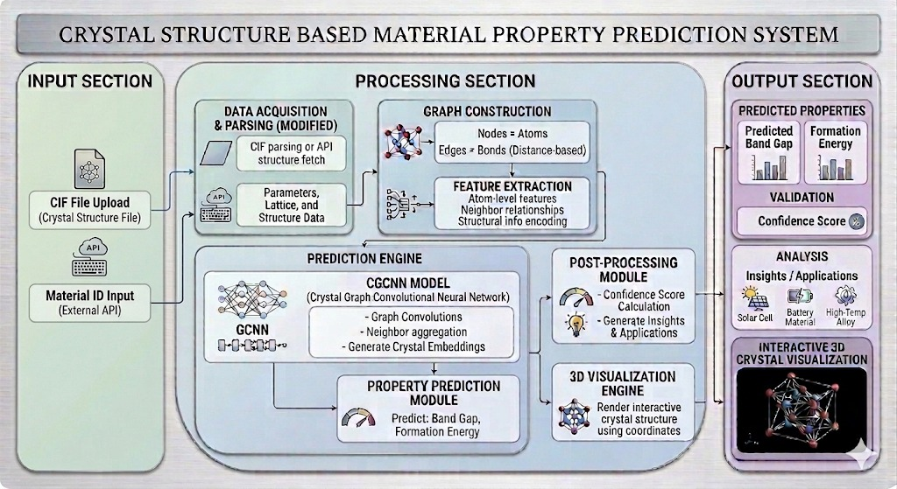
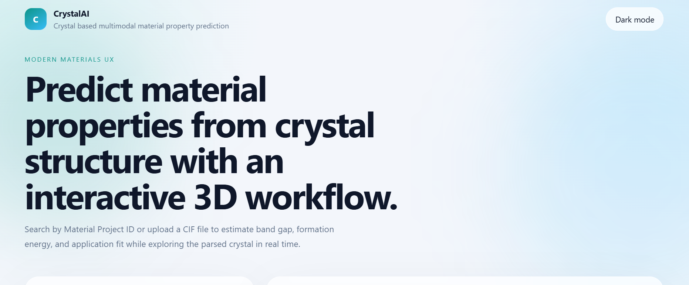
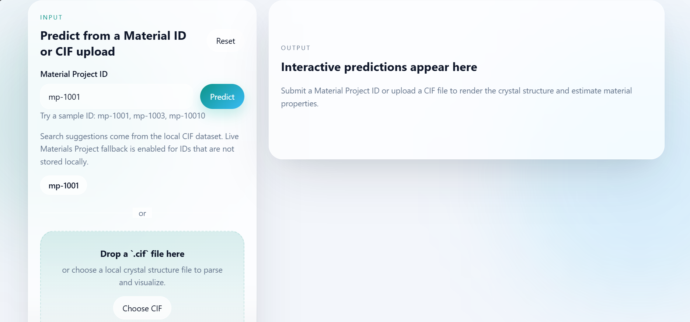

# CrystalAI

AI-powered Crystal Material Property Prediction using CGCNN, FastAPI, React, and Three.js.

CrystalAI is a polished full-stack web application designed for cutting-edge crystal-based material property prediction. It accepts either a Material Project ID or a user-uploaded `.cif` file, estimates critical material properties with CGCNN (Crystal Graph Convolutional Neural Networks) PyTorch models, and renders the parsed crystal structure in a stunning, interactive 3D viewer.

## System Architecture



## Tech Stack

- **Frontend:** React, Vite, Tailwind CSS, Framer Motion, Three.js
- **Backend:** FastAPI, PyTorch, CGCNN, pymatgen
- **Tools:** Docker, Git

## Project Overview

- **Frontend:** React + Vite spanning a modern responsive UI using premium glassmorphism, animated ambient lighting, dark mode, drag-and-drop `.cif` upload, loading skeletons, and PDF export.
- **Visuals:** Three.js crystal viewer featuring complete rotate, zoom, and pan controls alongside real-time IUPAC chemical naming mapping.
- **Backend:** FastAPI backend handling CIF parsing, Material ID validation, PyTorch CGCNN inference, and flexible error handling gracefully integrated with `pymatgen`.
- **Deployment:** A multi-stage `Dockerfile` making containerized production deployment seamless.

## Application Preview



## Prediction Interface



## Features

- **Live AI Inference:** Real-time ML generation of Band Gap, Formation Energy, and Confidence metrics natively inside the backend using CGCNNs.
- **3D Interactive Rendering:** Render an atom-for-atom mapping of crystal lattices visually from CIF parsing.
- **Predict via ID or Upload:** Query local Material IDs (e.g., `mp-149`), fallback seamlessly to the `mp-api` (Materials Project API), or drag-and-drop a `.cif` file directly.
- **Premium UI:** Engineered with Framer Motion transitions, responsive grids, and translucent frosted glass styling.
- **PDF Export:** Click to download a summary report of the predictions natively from the frontend.

## Quickstart (Docker Deployment)

CrystalAI relies on a unified multi-stage Docker build, simplifying deployments significantly. 

1. Ensure the PyTorch CGCNN models are trained. If `backend/models/cgcnn` is empty, run `python train_cgcnn_models.py` inside the `backend` directory.
   Required checkpoints:
   - `backend/models/cgcnn/band-gap/model_best.pth.tar`
   - `backend/models/cgcnn/formation-energy-per-atom/model_best.pth.tar`
2. Build the combined Docker image from the project root:
   ```bash
   docker build -t crystalai .
   ```
3. Run the complete application (Frontend serving on port 7860, proxied directly to the FastAPI server):
   ```bash
   docker run -p 7860:7860 crystalai
   ```
4. Access `http://localhost:7860` via your web browser.

### Deploying to Hugging Face Spaces
This project is already pre-configured for a seamless deployment to HF Spaces. 
1. Create a new Space on [Hugging Face](https://huggingface.co/spaces) and select **Docker** as the Space SDK and **Blank** as the Docker template.
2. Push your code to the Hugging Face Space repository using standard Git commands.
3. The Space will automatically build the `Dockerfile` and run the app on port 7860.

## Quickstart (Local Development)

If you wish to edit the raw React or Fastapi files and take advantage of Hot-Module-Reloading during development:

### 1. Backend
```bash
cd backend
python -m venv .venv
# Activate virtual environment (.venv\Scripts\activate on Windows)
pip install -r requirements.txt
python train_cgcnn_models.py  # Train PyTorch checkpoints (CGCNN)
uvicorn app.main:app --reload
```
*The API will start at http://127.0.0.1:8000*

### 2. Frontend
Open a **second terminal**:
```bash
cd frontend
npm install
npm run dev
```
*The app will start at http://127.0.0.1:5173*


## Optional: Live Materials Project Lookup
To allow fallback lookups for MIDs not in your local CSV:
```bash
# Set your API Key in your terminal
set MP_API_KEY=your_materials_project_api_key
```
The backend automatically configures `MPRester().get_structure_by_material_id(...)` if an API key is present exactly as specified in the Materials Project docs.
